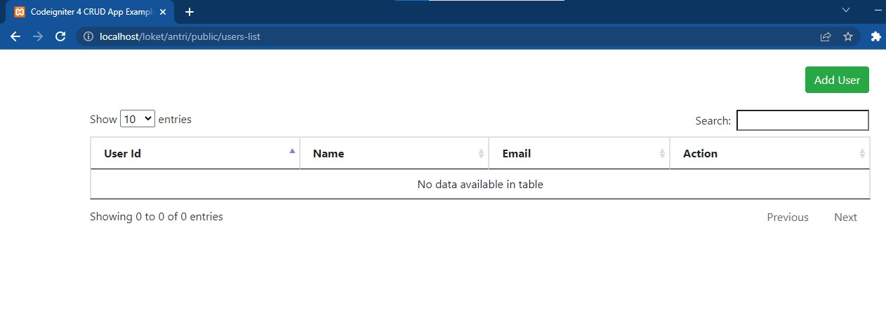
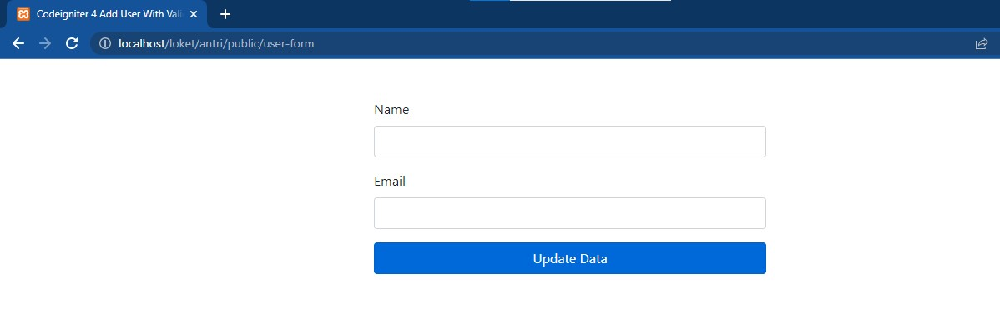
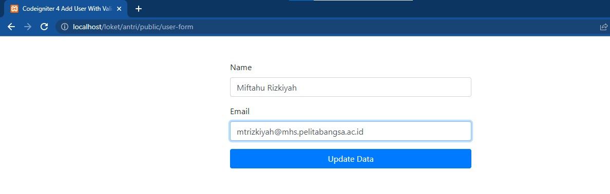
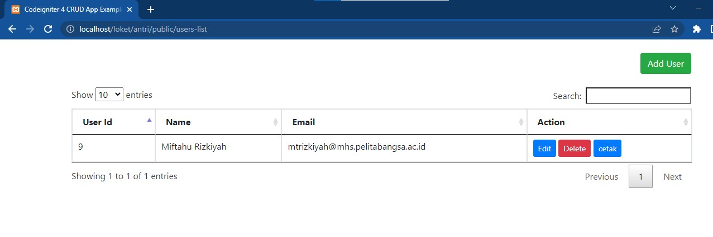
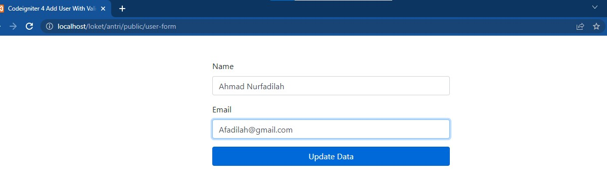
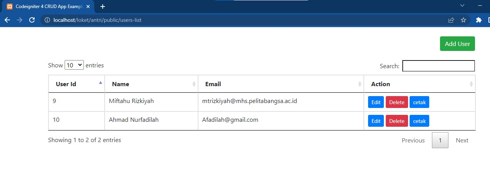
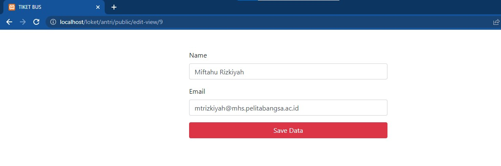
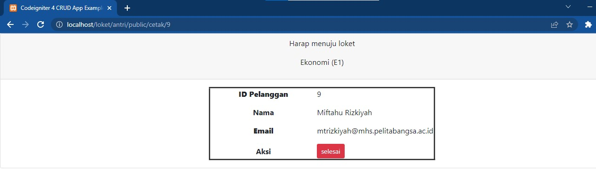
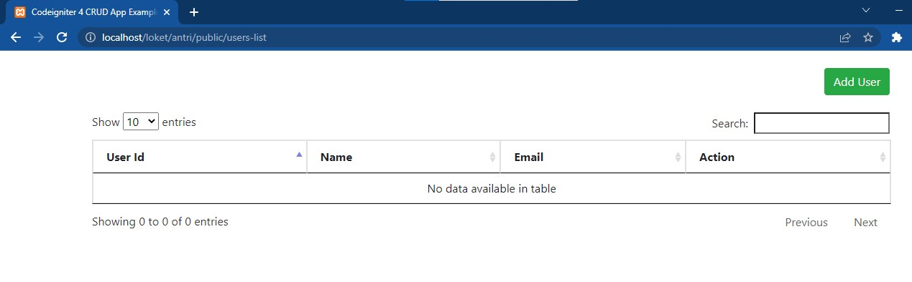

# UAS_Loket
Repository ini dibuat untuk memenuhi UAS mata kuliah Pemograman Web

Nama : Miftahu Rizkiyah 
NIM  : 312010014 
Kelas : TI.20.B1 

# UAS membuat web loket antrian

web localhost untuk loket antrian

http://localhost/loket/antri/public/users-list

## Tampilan utama

## selanjutnya add user

## selanjutnya

## lalu

## untuk menu edit

## untuk menu cetak

## untuk menu hasil delete

## Bersambung........